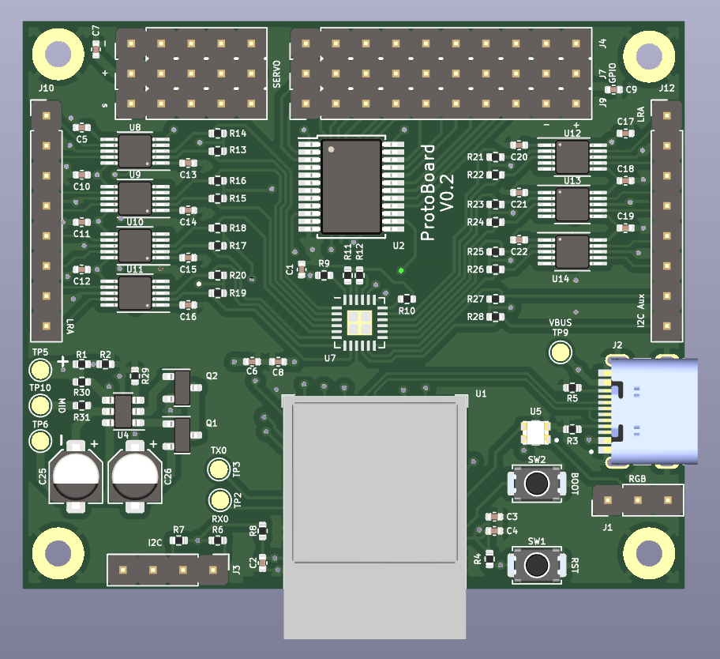
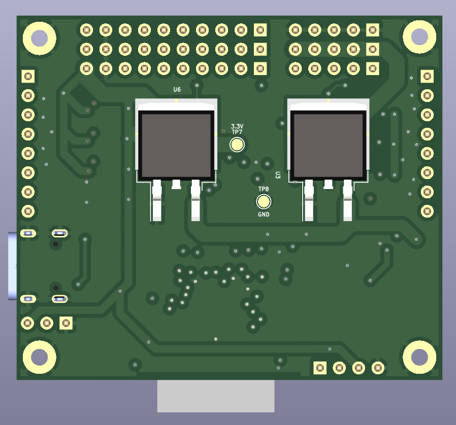
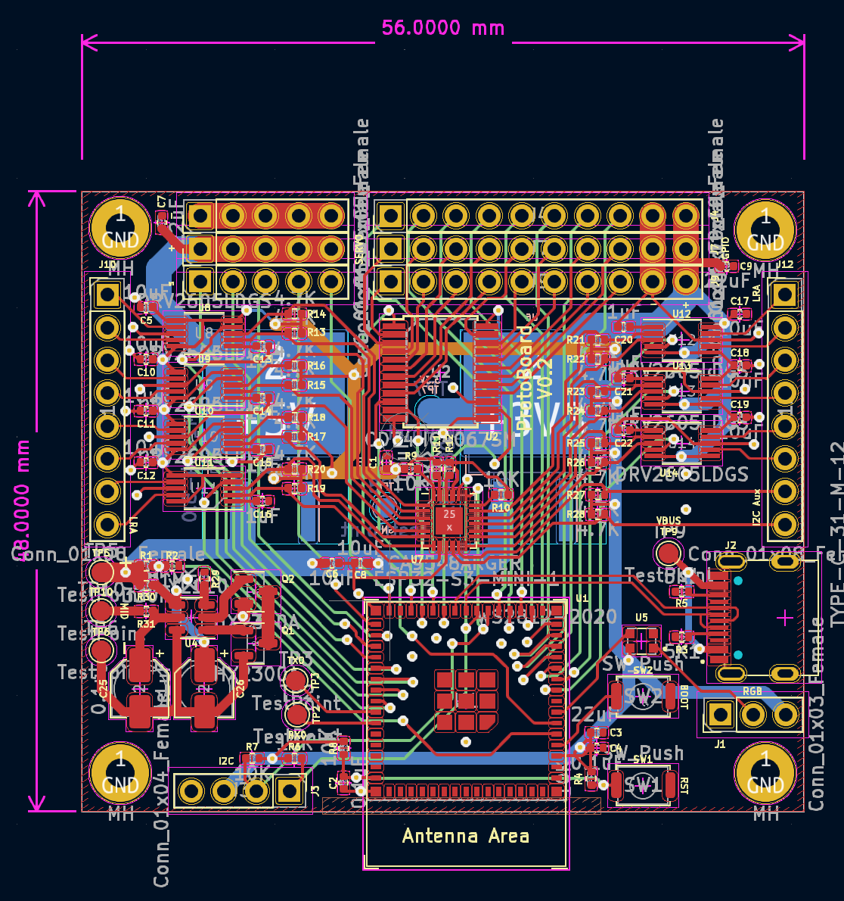
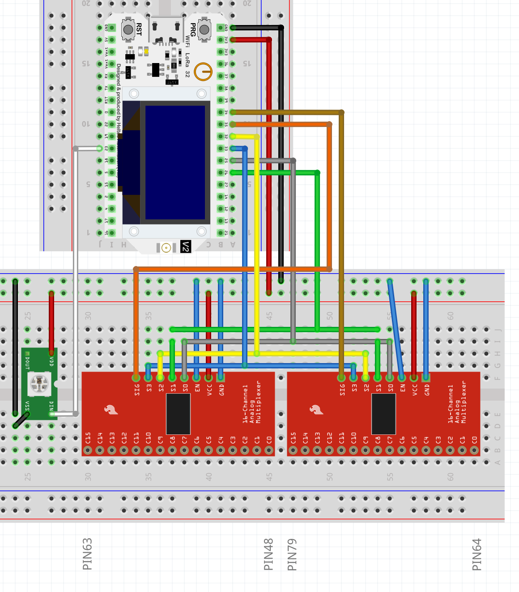
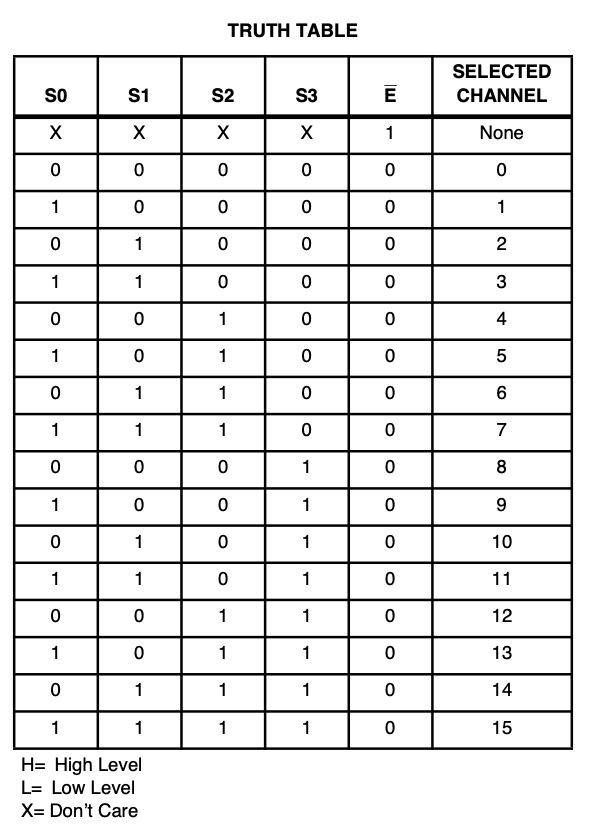

# ProtoBoard

A small board (35 x 50 mm) for great gloves !

# Features

## Pros :
- ESP32 dual core
- Small (35x50 mm)
- Power from 2S to 4S lipo (accept 6.5 volt up to 20 volt)
- Can use Wifi (doesnt use ADC2)
- 32 ADC input
- 1 extra GPIO (can be used for anything for instance RGB)
- 5V 5A for Servo with current protection
- Support up to 6 LRA (small vibrating motor, also have current protection)
- [QWIIC](https://www.sparkfun.com/qwiic) connector (for extension like display or IMU for SlimeVR or heartbeat sensor...)
- Up to 5 Servo
- Battery level (via voltage divider)
- Cheap to build
- Use JST GH 1.25 connector (cheap and easy to find)

## Cons :
- Compoment on both side => more expensive to produce in small quantity in pcb fab
- No on board USB (Boot0, EN, RX0, TX0 via solder pad)
- Doesnt charge the battery
- PCB is 4 layer (a bit more expensive than 2 layer PCB)

## BOM

|    Reference    | Name | Qty | URL |
|-----------------|------|-----|-----|
|R1, R2, R3, R4, R5, R6, R7, R8, R15| 10K 10% 0402 resistor | 9 | [url]() | 
|C2, C4| 0.1uF 0402 capacitor | 2 | [url]() |
|C3, C7, C9| 22uF 0402 capacitor | 3 | [url]() |
|R11, R12| 6.8K 1% 0402 resistor | 2 | [url]() |
|R10| 3.4K 1% 0402 resistor | 1 | [url]() |
|R9| 1.7K 1% 0402 resistor | 3 | [url]() |
|U7, U8, U9, U10| SY6280AAC overcurrent protection | 4 | [url]() |
|U1| ESP32-WROOM-32D | 1 | [url]() |
|J3| QWIIC connector | 1 | [url]() |
|R14| 5M 1% 0402 | 1 | [url]() |
|R13| 1M 1% 0402 | 1 | [url]() |
|U2, U4| CD74HC4067SM analog multiplexer | 2 | [url]() |
|U3| LM1084-5.0 5volt 5A regulator | 1 | [url]() |
|U6| LM1084 | 1 | [url]() |
|C6, C8| 10uF 0402 capacitor | 2 | [url]() |
|IC1, IC2, IC3| L9110S motor controller | 3 | [url]() |
|J4, J7, J9, J11| JST GH 1.25 vertical smd 10 pin | 4 | [url]() |
|J2| JST GH 1.25 vertical smd 8 pin | 1 | [url]() |
|C6, C8| 10uF 0402 capacitor | 2 | [url]() |
|J5, J6, J8| connector 2.54 male header | 3 | [url]() |

## Multiplexer implementation

The ESP32 with the most gpio have 48 gpio (GPIO0 to GPIO47) to simplify the GPIO logic, I decided that the 32 gpio of the multiplexer are GPIO48 to GPIO79. Related code [here](firmware/lucidgloves-firmware/AdcMux.hpp).

Equivalent fritzing diagram

Pinout :
- S0 is GPIO26
- S1 is GPIO25
- S2 is GPIO32
- S3 is GPIO33
- Two adc pin from the ESP32 are used GPIO35 (multiplexer 1 : GPIO48 to GPIO63) and GPIO34 (multiplexer 2 : GPIO64 to GPIO79)

## TODO

- Add url for bom
- Add documentation to buy pcb
- Add battery level information
- Add pinout